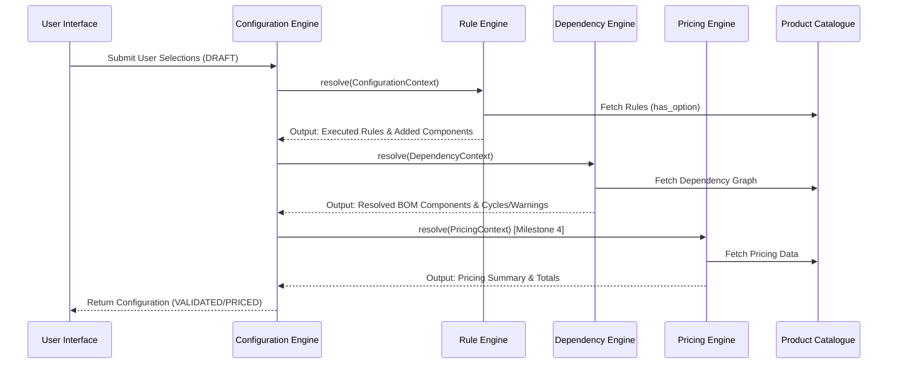

# Architecture Overview

This document outlines the high-level architecture of the Elevator Configuration & Pricing Engine.

## Configuration Pipeline

The following sequence diagram illustrates the processing pipeline of a `Configuration` as it flows through the backend engines.

## Architectural Tenets
1. **Engine Isolation**: Each engine operates independently, accepting a strict `Context` object and returning a `Report`.
2. **Immutable Catalogue**: The `ProductCatalogue` is read-only during execution. Updates to the catalogue trigger version bumps and cache invalidations.
3. **State Accumulation**: The `Configuration` acts as an event-sourced accumulator, maintaining a history of `mutations` caused by the pipeline.
