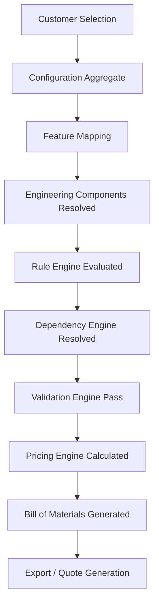

# Architecture Overview — Elevator Configuration & Pricing Engine

## System Context

```
┌────────────────────────────────────────────────────────────────┐
│                        Client (Browser)                         │
│              React + TypeScript + Vite + Tailwind               │
└───────────────────────────┬────────────────────────────────────┘
                            │  HTTPS / JSON
                            ▼
┌────────────────────────────────────────────────────────────────┐
│                   FastAPI Backend (Python 3.12)                 │
│                                                                  │
│  ┌──────────┐  ┌───────────┐  ┌────────────┐  ┌────────────┐  │
│  │Middleware│→ │ API Layer │→ │  Services  │→ │Repositories│  │
│  │  (CORS,  │  │ (schemas) │  │ (business  │  │ (data      │  │
│  │  logging)│  │           │  │  logic)    │  │  access)   │  │
│  └──────────┘  └───────────┘  └────────────┘  └─────┬──────┘  │
│                                                       │         │
│  ┌─────────────────────────────────────────────────┐ │         │
│  │ Engines                                         │ │         │
│  │  RuleEngine | DependencyEngine | PricingEngine  │◄┘         │
│  └─────────────────────────────────────────────────┘           │
│                                                                  │
│  ┌──────────────────────────────────────────────────────────┐  │
│  │ JSON Data Files (app/data/)                               │  │
│  │  components.json | features.json | dependencies.json      │  │
│  │  rules.json | pricing.json | categories.json              │  │
│  │  catalog_metadata.json | feature_mappings.json            │  │
│  │  feature_options.json | feature_groups.json               │  │
│  └──────────────────────────────────────────────────────────┘  │
└────────────────────────────────────────────────────────────────┘
```

## Layer Responsibilities

| Layer | Package | Responsibility |
|-------|---------|----------------|
| **Middleware** | `app/middleware/` | CORS, request logging, trace IDs |
| **API** | `app/api/v1/` | HTTP routing, schema validation only |
| **Schemas** | `app/schemas/` | API request/response Pydantic models |
| **Services** | `app/services/` | Business logic orchestration |
| **Engines** | `app/rules/`, `app/pricing/`, `app/dependency_engine/` | Domain algorithms |
| **Repositories** | `app/repositories/` | Data access abstraction |
| **Utils** | `app/utils/` | File I/O, caching (DataLoader) |
| **Models** | `app/models/` | Internal domain entities |
| **Core** | `app/core/` | Config, constants, exceptions, logging |

## Technology Stack

| Component | Technology |
|-----------|-----------|
| Backend framework | FastAPI 0.115+ |
| ASGI server | Uvicorn |
| Data validation | Pydantic v2 |
| Settings | pydantic-settings |
| Python | 3.12 |
| Frontend | React + TypeScript + Vite + Tailwind CSS |
| Data storage | JSON files (SQL-swappable via Repository pattern) |
| Testing | pytest + httpx |
| Linting | Ruff |
| Formatting | Black |

## Key Design Decisions

### 1. App Factory Pattern
`create_app()` in `app/__init__.py` allows the test suite to instantiate
the app with different settings without starting a real server.

### 2. Repository Abstraction
Services depend on `BaseRepository[T]`, not `JSONRepository`.
Migrating to SQL = implement `SQLRepository(BaseRepository[T])`.
Zero service/API changes needed.

### 3. Exception Hierarchy
Every exception carries `error_code` and `http_status`.
Global handlers in `create_app()` convert them to `ErrorResponse` JSON.
No raw Python exceptions ever reach the HTTP client.

### 4. Fail-Fast Startup
`validate_data_files()` runs before the app accepts any request.
Missing or corrupt JSON → `RuntimeError` → process exits.
Prevents silent data failures during rule evaluation.

### 5. Data-Driven Design
All business data (components, rules, pricing) lives in JSON files.
Application logic reads these files; it contains no hardcoded domain data.
Rule engine evaluates rules dynamically — no compiled-in conditionals.

## Future Milestone Architecture Map

| Milestone | Adds To |
|-----------|---------|
| M1 — Component Catalogue | `models/`, `services/`, `repositories/`, `api/v1/endpoints/components.py` |
| M2 — Rule Engine | `rules/`, `config_engine/` |
| M3 — Dependency Resolution | `dependency_engine/`, `validators/` |
| M4 — Pricing Engine | `pricing/`, `api/v1/endpoints/pricing.py` |
| M5 — Full Configuration API | `api/v1/endpoints/configuration.py` |
| M6 — Export | `utils/exporters/` |
| M7 — Frontend UI | `frontend/src/` (full implementation) |

## Dependency Classification

Dependencies in the system are classified to help engines apply rules in the correct order:
- **MECHANICAL**: Physical compatibility (e.g., Motor requires specific Drive).
- **ELECTRICAL**: Power and wiring (e.g., Controller requires matching Voltage).
- **STRUCTURAL**: Weight and dimensions (e.g., Cabin weight dictates Frame type).
- **SAFETY**: Regulatory and compliance constraints (e.g., Speed > 1.0m/s requires Oil Buffer).
- **BUSINESS**: Commercial constraints (e.g., "Premium Package" requires "Stainless Steel").

## Execution Pipeline

When a customer selects a set of features, the backend processes the configuration through the following pipeline:



## Configuration Lifecycle

A `Configuration` aggregate moves through these states:
1. **DRAFT**: User is actively selecting features.
2. **VALIDATED**: All rules and dependencies have passed; no engineering conflicts exist.
3. **PRICED**: The pricing engine has attached a valid quote to the validated state.
4. **APPROVED**: A sales representative or customer has formally accepted the quote.
5. **EXPORTED**: The BOM and specs are sent to manufacturing (ERP integration).

## Future API Planning

Future milestones will implement these primary REST API contracts:

- `POST /api/v1/configurations` -> Creates a new DRAFT configuration session.
- `PUT /api/v1/configurations/{id}` -> Updates feature selections.
- `POST /api/v1/configurations/{id}/validate` -> Triggers Rule & Dependency engines, returns ValidationResult.
- `GET /api/v1/configurations/{id}/price` -> Triggers Pricing Engine, returns PricingSummary.
- `POST /api/v1/configurations/{id}/export` -> Generates PDF quote and JSON BOM.

## Dependency Resolution Engine (Milestone 3)

The Dependency Engine consumes the Configuration produced by the Rule Engine and traverses the physical constraints of the elevator.

### Graph Construction & Traversal
- **Hybrid Approach**: Edges in the graph denote `REQUIRES`, `EXCLUDES`, `RECOMMENDS` relationships. Edges can contain dynamic `condition_expression` strings evaluated using the Rule Engine's DSL.
- **Topological Sorting**: We use Kahn's Algorithm to mathematically ensure cascading constraints (e.g., A requires B, B requires C) are evaluated in the correct hierarchical sequence.
- **Cycle Detection**: Any circular physical dependencies raise a fatal `CircularDependencyError`, enforcing strict, paradox-free engineering models.

### Traceability
All changes (added components or options) generated by the Dependency Engine are appended to the `Configuration.mutations` log. This ensures absolute traceability when differentiating between user choices, rule actions, and physical dependency cascading.


## Rule Engine Extensibility Guide (Milestone 2)

The Rule Engine operates as a pipeline centered around `RuleContext` and `RuleEvaluator`. It has been designed for horizontal extensibility:

### Adding New Triggers
1. Add the new trigger to `RuleTriggerType` in `constants.py`.
2. The `RuleRegistry` will automatically index rules under the new trigger on startup.
3. Call `evaluator.evaluate(config, RuleTriggerType.YOUR_NEW_TRIGGER)`.

### Adding New Actions
1. Add the new action enum to `RuleAction` in `constants.py`.
2. Create a handler class extending `BaseActionHandler` in `action_handlers.py`.
3. Register it in `ActionRegistry._register_defaults()`.
No modifications to `RuleEvaluator` are necessary.

### Extending the Condition DSL
1. Add a new `ConditionNode` subclass in `dsl.py` (e.g., `HasFeatureNode`).
2. Update `ConditionParser._transform()` to parse the new function name.
3. Update `ConditionEvaluator` to implement the corresponding `visit_*` method.

### Lifecycle Events (Hooks)
The `RuleEvaluator` natively fires:
- `BeforeRule`: Hooked before a condition is parsed.
- `AfterRule`: Hooked after execution or skipping.
- `BeforeAction`: Hooked after a condition is met, before payload validation.
- `AfterAction`: Hooked after the `ActionHandler` mutates the configuration.
These hooks can be overridden or extended for debugging, tracing, and metrics aggregation.
