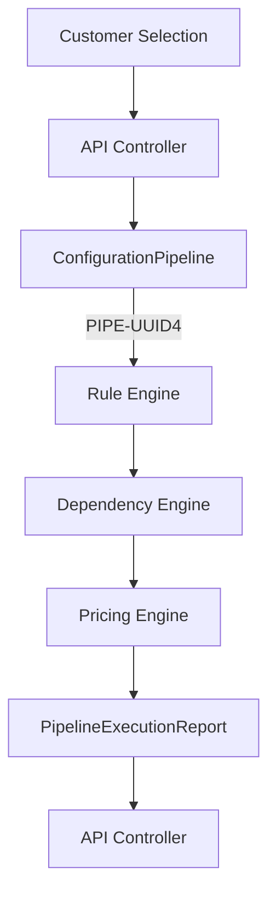

# Architecture Overview — Elevator Configuration & Pricing Engine

## System Context

```
┌────────────────────────────────────────────────────────────────┐
│                        Client (Browser)                         │
│              React + TypeScript + Vite + Tailwind               │
└───────────────────────────┬────────────────────────────────────┘
                            │  HTTPS / JSON
                            ▼
┌────────────────────────────────────────────────────────────────┐
│                   FastAPI Backend (Python 3.12)                 │
│                                                                  │
│  ┌──────────┐  ┌───────────┐  ┌────────────┐  ┌────────────┐  │
│  │Middleware│→ │ API Layer │→ │  Services  │→ │Repositories│  │
│  │  (CORS,  │  │ (schemas) │  │ (business  │  │ (data      │  │
│  │  logging)│  │           │  │  logic)    │  │  access)   │  │
│  └──────────┘  └───────────┘  └────────────┘  └─────┬──────┘  │
│                                                       │         │
│  ┌─────────────────────────────────────────────────┐ │         │
│  │ Engines                                         │ │         │
│  │  RuleEngine | DependencyEngine | PricingEngine  │◄┘         │
│  └─────────────────────────────────────────────────┘           │
│                                                                  │
│  ┌──────────────────────────────────────────────────────────┐  │
│  │ JSON Data Files (app/data/)                               │  │
│  │  components.json | features.json | dependencies.json      │  │
│  │  rules.json | pricing.json | categories.json              │  │
│  │  catalog_metadata.json | feature_mappings.json            │  │
│  │  feature_options.json | feature_groups.json               │  │
│  └──────────────────────────────────────────────────────────┘  │
└────────────────────────────────────────────────────────────────┘
```

## Layer Responsibilities

| Layer | Package | Responsibility |
|-------|---------|----------------|
| **Middleware** | `app/middleware/` | CORS, request logging, trace IDs |
| **API** | `app/api/v1/` | HTTP routing, schema validation only |
| **Schemas** | `app/schemas/` | API request/response Pydantic models |
| **Services** | `app/services/` | Business logic orchestration |
| **Engines** | `app/rules/`, `app/pricing/`, `app/dependency_engine/` | Domain algorithms |
| **Repositories** | `app/repositories/` | Data access abstraction |
| **Utils** | `app/utils/` | File I/O, caching (DataLoader) |
| **Models** | `app/models/` | Internal domain entities |
| **Core** | `app/core/` | Config, constants, exceptions, logging |

## Technology Stack

| Component | Technology |
|-----------|-----------|
| Backend framework | FastAPI 0.115+ |
| ASGI server | Uvicorn |
| Data validation | Pydantic v2 |
| Settings | pydantic-settings |
| Python | 3.12 |
| Frontend | React + TypeScript + Vite + Tailwind CSS |
| Data storage | JSON files (SQL-swappable via Repository pattern) |
| Testing | pytest + httpx |
| Linting | Ruff |
| Formatting | Black |

## Key Design Decisions

### 1. App Factory Pattern
`create_app()` in `app/__init__.py` allows the test suite to instantiate
the app with different settings without starting a real server.

### 2. Repository Abstraction
Services depend on `BaseRepository[T]`, not `JSONRepository`.
Migrating to SQL = implement `SQLRepository(BaseRepository[T])`.
Zero service/API changes needed.

### 3. Exception Hierarchy
Every exception carries `error_code` and `http_status`.
Global handlers in `create_app()` convert them to `ErrorResponse` JSON.
No raw Python exceptions ever reach the HTTP client.

### 4. Fail-Fast Startup
`validate_data_files()` runs before the app accepts any request.
Missing or corrupt JSON → `RuntimeError` → process exits.
Prevents silent data failures during rule evaluation.

### 5. Data-Driven Design
All business data (components, rules, pricing) lives in JSON files.
Application logic reads these files; it contains no hardcoded domain data.
Rule engine evaluates rules dynamically — no compiled-in conditionals.

## Future Milestone Architecture Map

| Milestone | Adds To |
|-----------|---------|
| M1 — Component Catalogue | `models/`, `services/`, `repositories/`, `api/v1/endpoints/components.py` |
| M2 — Rule Engine | `rules/`, `config_engine/` |
| M3 — Dependency Resolution | `dependency_engine/`, `validators/` |
| M4 — Pricing Engine | `pricing/`, `api/v1/endpoints/pricing.py` |
| M5 — Full Configuration API | `api/v1/endpoints/configuration.py` |
| M6 — Export | `utils/exporters/` |
| M7 — Frontend UI | `frontend/src/` (full implementation) |

## Dependency Classification

Dependencies in the system are classified to help engines apply rules in the correct order:
- **MECHANICAL**: Physical compatibility (e.g., Motor requires specific Drive).
- **ELECTRICAL**: Power and wiring (e.g., Controller requires matching Voltage).
- **STRUCTURAL**: Weight and dimensions (e.g., Cabin weight dictates Frame type).
- **SAFETY**: Regulatory and compliance constraints (e.g., Speed > 1.0m/s requires Oil Buffer).
- **BUSINESS**: Commercial constraints (e.g., "Premium Package" requires "Stainless Steel").

## Execution Pipeline

When a customer selects a set of features, the backend processes the configuration through a centralized `ConfigurationPipeline`. The pipeline maintains a strict REST boundary: endpoints only perform request validation and response serialization, while the pipeline owns orchestration and status state.



The `ConfigurationPipeline` handles:
1. **Engine Registration**: Maintains an ordered list of `BaseEngine` implementations.
2. **Correlation ID**: Generates a unified `PIPE-UUID4` passed down to all engines.
3. **Status Transitions**: Explicitly owns the progression of `Configuration.status` through its lifecycle (engines report only success/failure).
4. **Error Propagation**: Enforces error policies (`RULE_001`, `DEP_001`, `PRICE_001`, `PIPELINE_001`) and gracefully halts execution, maintaining a safe configuration state.

## Configuration Lifecycle

A `Configuration` aggregate moves through these states:
1. **DRAFT**: User is actively selecting features.
2. **VALIDATED**: All rules and dependencies have passed; no engineering conflicts exist.
3. **PRICED**: The pricing engine has attached a valid quote to the validated state.
4. **APPROVED**: A sales representative or customer has formally accepted the quote.
5. **EXPORTED**: The BOM and specs are sent to manufacturing (ERP integration).

## Future API Planning

Future milestones will implement these primary REST API contracts:

- `POST /api/v1/configurations` -> Creates a new DRAFT configuration session.
- `PUT /api/v1/configurations/{id}` -> Updates feature selections.
- `POST /api/v1/configurations/{id}/validate` -> Triggers Rule & Dependency engines, returns ValidationResult.
- `GET /api/v1/configurations/{id}/price` -> Triggers Pricing Engine, returns PricingSummary.
- `POST /api/v1/configurations/{id}/export` -> Generates PDF quote and JSON BOM.

## Dependency Resolution Engine (Milestone 3)

The Dependency Resolution Engine resolves physical engineering constraints by
traversing a dependency graph built from the Product Catalogue. It operates
after the Rule Engine and mutates only the `Configuration` aggregate.

### Module Map

| Module | File | Responsibility |
|---|---|---|
| `DependencyRepository` | `repository.py` | Loads `Dependency` records from `dependencies.json` via `BaseRepository` |
| `DependencyValidator` | `validator.py` | Validates referential integrity of raw deps against the catalogue |
| `DependencyRegistry` | `registry.py` | Caches validated deps; exposes adjacency / reverse-adjacency lookups |
| `GraphBuilder` | `graph_builder.py` | Builds `DependencyGraph` topology; resolves node entity types |
| `GraphCache` | `graph_cache.py` | Caches topology by `catalogue_version`; returns deep copies per request |
| `GraphValidator` | `graph_validator.py` | Validates graph structure; self-loops/duplicates = ERROR; orphans = WARNING |
| `DependencyActivationEngine` | `activation.py` | Evaluates DSL `condition_expression` on edges; writes only to request copy |
| `CycleDetector` | `cycle_detector.py` | Kahn's algorithm; raises `CircularDependencyError` on any cycle |
| `TraversalEngine` | `traversal.py` | BFS reachability from active config; returns topo order + reachable set |
| `BaseResolutionStrategy` | `strategies.py` | ABC; default impl `TopologicalResolutionStrategy` |
| `ResolutionExecutor` | `executor.py` | Sole authority to mutate `Configuration`; appends mutations + steps |
| `ConflictResolver` | `conflict_resolver.py` | Detects EXCLUDES violations; produces `DependencyConflict` records |
| `ResolutionLogger` | `logger.py` | Structured lifecycle logging with `correlation_id` |
| `DependencyResolver` | `resolver.py` | Pure orchestrator; fires 8 lifecycle events; never touches config directly |

### Resolution Pipeline

```
Configuration (post Rule Engine)

    ↓

GraphCache.get_or_build(catalogue_version)
  [topology reused if version unchanged; deep copy returned]

    ↓

DependencyActivationEngine
  [evaluates condition_expression per edge — writes to request copy only]

    ↓

GraphValidator
  [self-loops → ERROR | duplicate edges → ERROR | orphans → WARNING]

    ↓

CycleDetector  (Kahn's Algorithm)
  [fail-fast CircularDependencyError]

    ↓

TraversalEngine
  [BFS from active config entities → reachable set]
  [topological sort of full graph]

    ↓

TopologicalResolutionStrategy
  → per reachable node → ResolutionExecutor.apply(edge)
       ├── REQUIRES / DETERMINES → add entity + ConfigurationMutation + ResolutionStep(mutated=True)
       ├── EXCLUDES              → ConflictResolver → DependencyConflict + ResolutionStep(mutated=True)
       └── RECOMMENDS            → warning + ResolutionStep(mutated=False)

    ↓

DependencyResolutionReport
  [Section 1: Metrics | Section 2: Mutations | Section 3: Conflicts]
  [Section 4: Warnings | Section 5: Steps    | Section 6: Summary  ]
```

### Key Design Decisions

- **Version-based GraphCache**: The graph topology is built once per `catalogue_version`. TTL invalidation is explicitly rejected. Callers can call `cache.invalidate()` for administrative resets.
- **Activation isolation**: `DependencyActivationEngine` writes `is_active` only to the per-request deep copy. The shared cached graph is immutable.
- **Mutation boundary**: `ResolutionExecutor` is the only module that writes to `Configuration`. `DependencyResolver` is a pure orchestrator.
- **RECOMMENDS**: Produces a `ResolutionStep(mutated=False)` and a warning. Appears in the audit trail without being treated as a configuration change.
- **Orphan nodes**: GraphValidator logs a warning but continues. Orphans are legitimate (standalone accessories, prototype entries).

### Extension Guide — Adding a New Dependency Type

1. Add the new type to `DependencyType` in `app/core/constants.py`.
2. Add a handler branch in `ResolutionExecutor.apply()`.
3. Add a `ResolutionStep` with the appropriate `mutated` flag.
4. No changes required to `DependencyResolver`, `TraversalEngine`, `GraphBuilder`, or `GraphCache`.

### Graph Visualization (Future)

`DependencyGraph` can be serialized to DOT format for Graphviz visualization.
A future debug endpoint (`GET /api/v1/admin/dependency-graph`) can return the
DOT string, enabling visual inspection of the graph topology and active edges
for a given configuration — useful for engineering QA and support.


## Rule Engine Extensibility Guide (Milestone 2)

The Rule Engine operates as a pipeline centered around `RuleContext` and `RuleEvaluator`. It has been designed for horizontal extensibility:

### Adding New Triggers
1. Add the new trigger to `RuleTriggerType` in `constants.py`.
2. The `RuleRegistry` will automatically index rules under the new trigger on startup.
3. Call `evaluator.evaluate(config, RuleTriggerType.YOUR_NEW_TRIGGER)`.

### Adding New Actions
1. Add the new action enum to `RuleAction` in `constants.py`.
2. Create a handler class extending `BaseActionHandler` in `action_handlers.py`.
3. Register it in `ActionRegistry._register_defaults()`.
No modifications to `RuleEvaluator` are necessary.

### Extending the Condition DSL
1. Add a new `ConditionNode` subclass in `dsl.py` (e.g., `HasFeatureNode`).
2. Update `ConditionParser._transform()` to parse the new function name.
3. Update `ConditionEvaluator` to implement the corresponding `visit_*` method.

### Lifecycle Events (Hooks)
The `RuleEvaluator` natively fires:
- `BeforeRule`: Hooked before a condition is parsed.
- `AfterRule`: Hooked after execution or skipping.
- `BeforeAction`: Hooked after a condition is met, before payload validation.
- `AfterAction`: Hooked after the `ActionHandler` mutates the configuration.
These hooks can be overridden or extended for debugging, tracing, and metrics aggregation.

## Dynamic Pricing Engine (Milestone 4)

The Dynamic Pricing Engine strictly conforms to the `BaseEngine[PricingContext, PricingReport]` interface, executing at the end of the pipeline.

### Module Map

| Module | File | Responsibility |
|---|---|---|
| `PricingRepository` | `repository.py` | Loads structured pricing data from `pricing.json` |
| `PricingValidator` | `validator.py` | Fails fast on duplicate keys, missing tax config |
| `PricingRegistry` | `registry.py` | O(1) cache for `PricingRecord` lookup; holds currency/tax settings |
| `PricingCalculator` | `calculator.py` | Pure logic for base, component, and feature costs using `Decimal` |
| `TaxCalculator` | `tax_calculator.py` | Applies `TaxConfiguration` rates |
| `BOMCostResolver` | `bom_resolver.py` | Mutates `BOMItem.unit_cost` referencing back to pricing record IDs |
| `PricingEngine` | `engine.py` | Orchestrates context, calculates totals, generates `PricingSummary` |

### Engine Pipeline

1. **Category Base Price**: Looks up base price for `selected_category`.
2. **Feature Costs**: Sums up pricing for all `selected_feature_options`.
3. **Component Costs**: Sums up pricing for all `resolved_components`.
4. **Subtotal**: Sum of Category + Features + Components.
5. **Taxes**: Applies data-driven rate to subtotal.
6. **Total**: Final sum (`total_after_tax`).
7. **BOM Population**: Matches `resolved_components` to unit costs.
8. **Summary Generation**: Updates `Configuration.pricing_summary`.

The Pricing Engine features a strict missing price policy: any absent mandatory record triggers an immediate `PricingCalculationError`, populates `PricingReport.errors`, and aborts calculation. Status transitions are exclusively handled by the `ConfigurationPipeline`.
