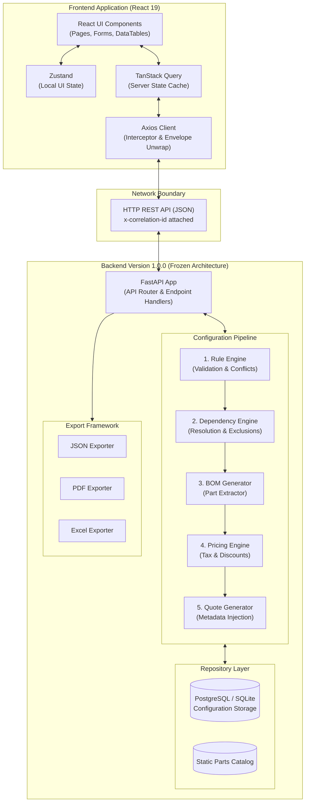

# Master Architecture Diagram

This diagram visually summarizes the entire Elevator Configurator platform, illustrating the complete lifecycle of a request from the React UI down through the frozen Backend Architecture and back.

## Flow Description
1. The **React UI** triggers an action (e.g., submitting the Configuration Wizard).
2. The mutation is passed to **TanStack Query**, which invokes the **Axios Client**.
3. The Axios Client issues an **HTTP REST** call across the network boundary to the **FastAPI** backend.
4. FastAPI passes the DTO into the **Configuration Pipeline**.
5. The Pipeline executes sequentially:
   - **Rule Engine** asserts hard constraints.
   - **Dependency Engine** resolves feature prerequisites.
   - **BOM Generator** extracts physical parts.
   - **Pricing Engine** calculates final costs.
   - **Quote Generator** wraps the payload in metadata.
6. The updated configuration is stored in the **Repository Layer**.
7. FastAPI returns an `APISuccessEnvelope` to the Frontend.
8. Axios intercepts the envelope, strips it to the pure data payload, and updates **TanStack Query**.
9. The **React UI** automatically re-renders with the fresh data (BOM, Pricing, Validation).
10. If the user clicks "Export", FastAPI directs the final payload to the **Export Framework**, streaming the resulting file back to the browser.
